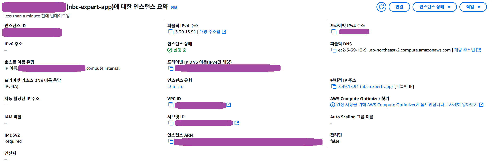
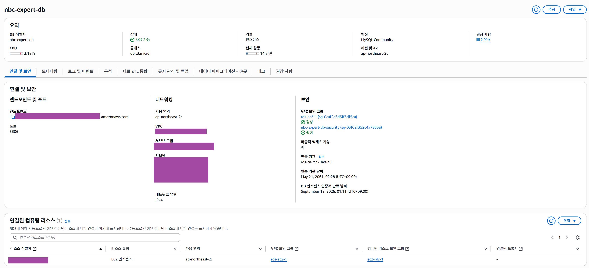
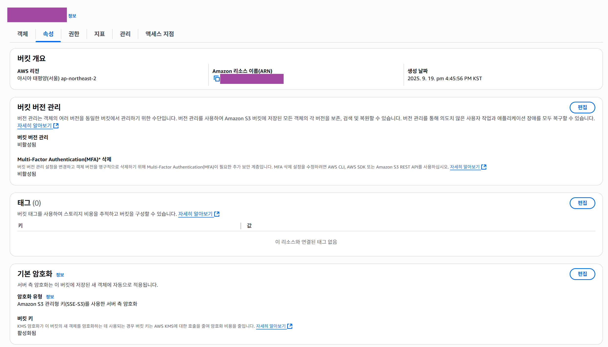
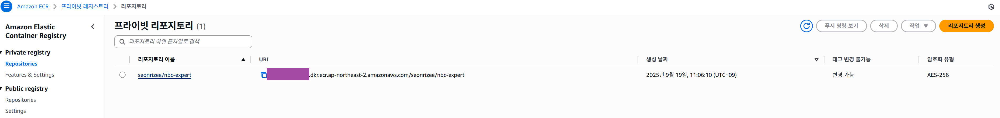
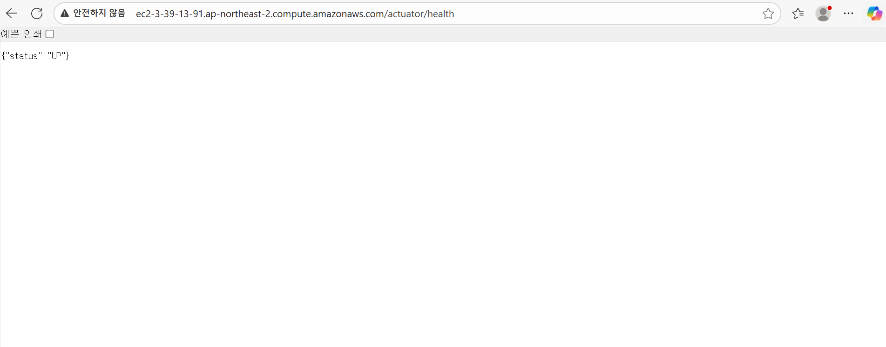

# SPRING PLUS

<!-- TOC -->

- [SPRING PLUS](#spring-plus)
    - [1. 프로젝트 개요](#1-프로젝트-개요)
    - [2. 주요 개발 밎 주안점](#2-주요-개발-밎-주안점)
        - [2.1. 주요 기능](#21-주요-기능)
        - [2.2. 주안점](#22-주안점)
    - [3. 개발 환경](#3-개발-환경)
    - [4. 실행 방법](#4-실행-방법)
    - [5. 과제 README 요구 사항](#5-과제-readme-요구-사항)
        - [5.1 AWS 서비스 콘솔 화면 캡쳐](#51-aws-서비스-콘솔-화면-캡쳐)
        - [5.2 AWS EC2 배포 APP Health Check API](#52-aws-ec2-배포-app-health-check-api)
        - [5.3 유저 닉네임 검색 성능 개선 과정 데이터](#53-유저-닉네임-검색-성능-개선-과정-데이터)
    - [6. 과제 해결 과정 및 회고](#6-과제-해결-과정-및-회고)
    - [7. 브랜치 전략 및 커밋 컨벤션](#7-브랜치-전략-및-커밋-컨벤션)

<!-- /TOC -->

## 1. 프로젝트 개요

- 이 프로젝트는 JPA를 활용한 동적 쿼리와 성능 개선, 테스트 코드 그리고 배포와 관련된 기술에 초점을 맞춘 과제입니다.
- 개발 일정: 2025년 9월 10일 ~ 2025년 9월 23일
- 개발 인원: 1인

## 2. 주요 개발 밎 주안점

### 2.1. 주요 기능

**Level 1.**

1. **코드 개선 퀴즈 - @Transactional의 이해**
    - 애플리케이션 실행 시 발생하는 에러의 원인을 분석하고 해결하여 정상적으로 실행되도록 조치합니다.
2. **코드 추가 퀴즈 - JWT의 이해**
    - 프론트엔드 개발자가 `JWT`에서 유저의 닉네임을 꺼내 보여줄 수 있도록 기능을 구현합니다.
3. **코드 개선 퀴즈 - JPA의 이해**
    - 할 일 검색 시 weather와 수정일 기준으로 검색이 가능하도록 기능을 구현해야 합니다.
4. **테스트 코드 퀴즈 - 컨트롤러 테스트의 이해**
    - 실패하고 있는 테스트 코드를 정상적으로 수행되어 통과할 수 있도록 수정합니다.
5. **코드 개선 퀴즈 - AOP의 이해**
    - 잘못 동작하고 있는 `AOP`를 의도에 맞도록 코드를 수정합니다.

**Level 2.**

6. **JPA Cascade**
    - JPA의 `cascade`기능을 활용해 할 일을 생성한 유저가 담당자로 등록할 수 있도록 구현합니다.
7. **N+1**
    - N+1 문제가 발생하지 않도록 코드를 수정합니다.
8. **QueryDSL**
    - `JPQL`로 작성된 레포지토리의 메소드를 `QueryDSL`로 변경합니다.
9. **Spring Security**
    - `Filter`와 `Argument Resolver`를 사용하던 코드들을 `Spring Security`로 변경합니다.

**Level 3.**

10. **QueryDSL 을 사용하여 검색 기능 만들기**
    - 일점을 검색하는 기능을 `QueryDSL`과 `Projections`를 활용해서 구현합니다.
11. **Transaction 심화**
    - `@Transacional` 옵션을 활용하여 매니저 등록 요청 시 DB에 로그가 기록되도록 구현합니다.
12. **AWS 활용**
    - EC2, RDS, S3를 사용해서 프로젝트를 관리하고 배포합니다. helath check API와 Presgined URL을 이용한 프로필 이미지 관련 API를 구현합니다.
13. **대용량 데이터 처리**
    - JDBC를 활용하여 유저 데이터 500만건을 생성하도록 테스트 코드를 작성합니다. 닉네임을 조건으로 유저 목록을 검색하는 API를 구현하고, 유저 검색 속도를 개선합니다.

### 2.2. 주안점

- **QueryDSL**를 활용한 동적 쿼리 작성과 **JPA를 활용한 성능 최적화** 방법을 익힙니다.
- 배포 후 발생할 수 있는 오류를 미리 방지하기 위한 **테스트 코드** 작성을 익힙니다.
- Docker와 AWS 그리고 Gihub를 이용하여 **자동화된 배포 환경**을 구축하고, **클라우드 기반 서비스 운영** 방법을 익힙니다.

## 3. 개발 환경

- **언어:** Java 17
- **프레임워크:** Spring Boot 3.2.x
- **ORM:** Spring Data JPA
- **빌드 도구:** Gradle
- **데이터베이스:** MySQL 8.x
- **테스트:** JUnit 5, Mockito
- **인프라**: AWS, Docker, Github
- **기타:** Lombok, Spring Security, QueryDSL, JWT, caffeine

## 4. 실행 방법

- `docker-compose`를 활용한 로컬 환경 통합 실행으로 간단 테스트 가능
    - `.env.example` 을 이용하여 `.env.docker` 환경 변수 구성
    - 아래에 나와 있는 값은 참조하여 구성

        ```bash
        # --- MySQL 컨테이너 초기화용 ---
        # MySQL 컨테이너 초기화에는 root 사용 불가
        MYSQL_USER=user
        
        # --- Spring Boot 앱 실행용 ---
        # docker-compose.docker.yml의 app 서비스가 이 값을 읽어 컨테이너에 주입. 여기서는 local 사용
        SPRING_PROFILES_ACTIVE=local
        
        # --- application-local.yml의 ${...} 를 채우는 변수들 ---
        DB_HOST=mysql # Docker 컨테이너 간 통신에는 'localhost'가 아닌 서비스 이름('mysql')을 사용
        DB_USERNAME=user # 컨테이너 초기화에 사용된 계정 이름과 동일하게 기입
        ```

    - `application-local.yml` 프로파일 검토 및 활성화
    - `docker-compose.docker.yml` 을 이용하여 실행

        ```bash
        gradle clean build
        docker compose -f docker-compose.docker.yml up -d --build
        ```

## 5. 과제 README 요구 사항

### 5.1 AWS 서비스 콘솔 화면 캡쳐

1. **EC2**

   

2. **RDS**

   

3. **S3**

   

4. **Elastic IP**

   

5. **ECR**

   

### 5.2 AWS EC2 배포 APP Health Check API

- 인증 없이 접속 가능
- 과제에서는 로드 밸런서 및 리버스 프록시를 위한 웹 서버를 편의상 생략하고, Elastic IP를 통해 직접 접속 가능한 구조로 구성
    - **퍼블릭 DNS 접속 주소:**
      [ec2-3-39-13-91.ap-northeast-2.compute.amazonaws.com/actuator/health](http://ec2-3-39-13-91.ap-northeast-2.compute.amazonaws.com/actuator/health)
    - **퍼블릭 IPv4 접속 주소:** [3.39.13.91/actuator/health](http://3.39.13.91/actuator/health)



### 5.3 유저 닉네임 검색 성능 개선 과정 데이터

- **테스트 환경**: 500만 건의 유저 데이터
    - JDBC와 테스트 코드를 이용하여 500만 건의 유저 데이터 저장
        - RAW JDBC 활용한 저장 및 결과

        ```java
        package org.example.expert.domain.user;
        
        import java.sql.Connection;
        import java.sql.PreparedStatement;
        import java.time.LocalDateTime;
        import java.util.UUID;
        import javax.sql.DataSource;
        import org.junit.jupiter.api.Test;
        import org.springframework.beans.factory.annotation.Autowired;
        import org.springframework.boot.test.context.SpringBootTest;
        import org.springframework.security.crypto.password.PasswordEncoder;
        
        @SpringBootTest
        class UserBulkInsertTest {
        
            @Autowired
            private DataSource dataSource;
        
            @Autowired
            private PasswordEncoder passwordEncoder;
        
            private static final int TOTAL = 5_000_000;
            private static final int BATCH_SIZE = 10_000; // 배치 크기
        
            @Test
        //    @Disabled("bulkInsert 테스트는 필요시에 로컬 DB에서 수동 실행하기")
            void JDBC로_500만_유저_데이터를_생성한다() throws Exception {
        
                long start = System.currentTimeMillis();
        
                String encodedPassword = passwordEncoder.encode("password123");
        
                try (Connection conn = dataSource.getConnection()) {
                    conn.setAutoCommit(false);
        
                    final String sql = "INSERT INTO users (created_at, email, modified_at, nickname, password, user_role) VALUES (?, ?, ?, ?, ?, ?)";
                    try (PreparedStatement ps = conn.prepareStatement(sql)) {
                        for (int i = 1; i <= TOTAL; i++) {
                            LocalDateTime now = LocalDateTime.now();
                            String email = "user" + i + "@example.com";
                            String nickname = randomNickname(i);
                            String role = "USER";
        
                            ps.setObject(1, now);
                            ps.setString(2, email);
                            ps.setObject(3, now);
                            ps.setString(4, nickname);
                            ps.setString(5, encodedPassword);
                            ps.setString(6, role);
        
                            ps.addBatch();
        
                            if (i % BATCH_SIZE == 0) {
                                ps.executeBatch();
                                conn.commit();
                            }
                        }
        
                        // 남은 데이터 처리
                        ps.executeBatch();
                        conn.commit();
                    }
                }
        
                long end = System.currentTimeMillis();
                System.out.println("Bulk insert completed in ms: " + (end - start));
            }
        
            private static String randomNickname(int idx) {
                return "nick_" + idx + "_" + UUID.randomUUID().toString().substring(0, 8);
            }
        }
        
        ```

      

        - JdbcTemplate 활용한 저장 및 결과

        ```java
        package org.example.expert.domain.user;
        
        import java.time.LocalDateTime;
        import java.util.ArrayList;
        import java.util.List;
        import java.util.UUID;
        import org.junit.jupiter.api.DisplayName;
        import org.junit.jupiter.api.Test;
        import org.springframework.beans.factory.annotation.Autowired;
        import org.springframework.boot.test.context.SpringBootTest;
        import org.springframework.jdbc.core.JdbcTemplate;
        import org.springframework.security.crypto.password.PasswordEncoder;
        
        @SpringBootTest
        class UserBulkInsertWithJdbcTemplateTest {
        
            @Autowired
            private JdbcTemplate jdbcTemplate;
        
            @Autowired
            private PasswordEncoder passwordEncoder;
        
            private static final int TOTAL = 5_000_000;
            private static final int BATCH_SIZE = 10_000; // 배치 크기
        
            @Test
        //    @Disabled("bulkInsert 테스트는 필요시에 로컬 DB에서 수동 실행하기")
            @DisplayName("JdbcTemplate Batch로 500만 사용자 생성")
            void JDBC로_500만_유저_데이터를_생성한다() {
        
                long start = System.currentTimeMillis();
        
                String encodedPassword = passwordEncoder.encode("password123");
        
                final String sql = "INSERT INTO users (created_at, email, modified_at, nickname, password, user_role) VALUES (?, ?, ?, ?, ?, ?)";
        
                List<Object[]> batchArgs = new ArrayList<>();
                for (int i = 1; i <= TOTAL; i++) {
                    LocalDateTime now = LocalDateTime.now();
                    String email = "user" + i + "@example.com";
                    String nickname = randomNickname(i);
                    String role = "USER";
        
                    batchArgs.add(new Object[]{now, email, now, nickname, encodedPassword, role});
        
                    if (i % BATCH_SIZE == 0) {
                        jdbcTemplate.batchUpdate(sql, batchArgs);
                        batchArgs.clear(); // 리스트 초기화
                    }
                }
        
                // 남은 데이터 처리
                if (!batchArgs.isEmpty()) {
                    jdbcTemplate.batchUpdate(sql, batchArgs);
                }
        
                long end = System.currentTimeMillis();
                System.out.println("Bulk insert with JdbcTemplate completed in ms: " + (end - start));
            }
        
            private static String randomNickname(int idx) {
                return "nick_" + idx + "_" + UUID.randomUUID().toString().substring(0, 8);
            }
        }
        ```

      

- **테스트 방식**: 특정 닉네임에 대해 10회 반복 조회 후 평균 응답 시간 측정
    - 실제 데이터 2,600,000번째 레코드의 nickname(nick_2600000_baf23fbd)으로 검색

    ```java
    package org.example.expert.domain.user;
    
    import static org.springframework.test.web.servlet.request.MockMvcRequestBuilders.get;
    import static org.springframework.test.web.servlet.result.MockMvcResultMatchers.status;
    
    import java.util.ArrayList;
    import java.util.List;
    import org.junit.jupiter.api.Test;
    import org.springframework.beans.factory.annotation.Autowired;
    import org.springframework.boot.test.autoconfigure.web.servlet.AutoConfigureMockMvc;
    import org.springframework.boot.test.context.SpringBootTest;
    import org.springframework.security.test.context.support.WithMockUser;
    import org.springframework.test.web.servlet.MockMvc;
    
    @SpringBootTest
    @AutoConfigureMockMvc
    class UserSearchPerformanceTest {
    
        @Autowired
        private MockMvc mockMvc;
    
        @Test
    //    @Disabled("성능 측정은 테스트는 필요시에 로컬 DB에서 수동 실행하기")
        @WithMockUser
        void 닉네임으로_유저_검색_성능_측적_테스트() throws Exception {
    
            // 500만 건 데이터 중 존재하는 닉네임으로 검색
            String existingNickname = "nick_2600000_baf23fbd";
    
            int iterations = 10; // 정확한 측정을 위해 10번 반복하여 평균값 사용
            List<Long> durations = new ArrayList<>();
    
            // 워밍업
            mockMvc.perform(get("/users").param("nickname", existingNickname));
    
            // 실제 측정
            for (int i = 0; i < iterations; i++) {
                long start = System.currentTimeMillis();
    
                mockMvc.perform(get("/users")
                                .param("nickname", existingNickname))
                        .andExpect(status().isOk());
    
                long end = System.currentTimeMillis();
                durations.add(end - start);
                System.out.printf("[측정 결과] Iteration %d: %d ms%n", i + 1, (end - start));
            }
    
            double average = durations.stream().mapToLong(Long::longValue).average().orElse(0.0);
            System.out.printf("[측정 결과] 닉네임 검색 평균 응답 시간 (10회): %.2f ms%n", average);
        }
    }
    ```

- **테스트 요약**

  | 개선 단계 | 적용 기술 | API 응답 속도 (평균) | 최초 상태 대비 성능 향상 |
    | --- | --- | --- | --- |
  | **최초 상태** | 없음 | **1776.80 ms** | - |
  | **1차 개선** | `인덱스(Index)` 적용 | **9.30 ms** | 약 191배 |
  | **2차 개선** | `인덱스(Index)` +`캐시(Cache)` 적용 | **1.70 ms** | 약 1045배 |

- **캡쳐 화면**

  

  

  

- **비고**
    - 개선 관련하여 고민 내용은 회고 참조

## 6. 과제 해결 과정 및 회고

- [과제 해결 과정 및 회고 링크](https://seonrizee.github.io/blog/2025-09-23-ch5-plus)

| **과제**                                  | **해결 과정** |
|-----------------------------------------|-----------|
| **Lv 1. 코드 개선 퀴즈 - @Transactional의 이해** |           |
| **Lv 2. 코드 추가 퀴즈 - JWT의 이해**            |           |
| **Lv 3. 코드 개선 퀴즈 -  JPA의 이해**           |           |
| **Lv 4. 테스트 코드 퀴즈 - 컨트롤러 테스트의 이해**      |           |
| **Lv 5. 코드 개선 퀴즈 - AOP의 이해**            |           |
| **Lv 6. JPA Cascade**                   |           |
| **Lv 7. N+1**                           |           |
| **Lv 8. QueryDSL**                      |           |
| **Lv 9. Spring Security**               |           |
| **Lv 10. QueryDSL 을 사용하여 검색 기능 만들기**    |           |
| **Lv 11. Transaction 심화**               |           |
| **Lv 12. AWS 활용**                       |           |
| **Lv 13. 대용량 데이터 처리**                   |           |

## 7. 브랜치 전략 및 커밋 컨벤션

- **브랜치 전략**

    - main 브랜치 commit, 별도의 PR 사용하지 않음

- **커밋 컨벤션**

    ```
    feat: 새로운 기능 추가
    fix: 버그 수정
    refactor: 코드 리펙토링
    docs: 문서 추가 및 수정
    chore: code와 관련 없는 설정, 변경
    test: 테스트 코드 관련 작성
    ```

    - `타입(레벨): 제목`형식으로 작성
    - 일부 메시지는 상세 설명 작성
    - [**Conventional Commits 참고**](https://www.conventionalcommits.org/ko/v1.0.0/)